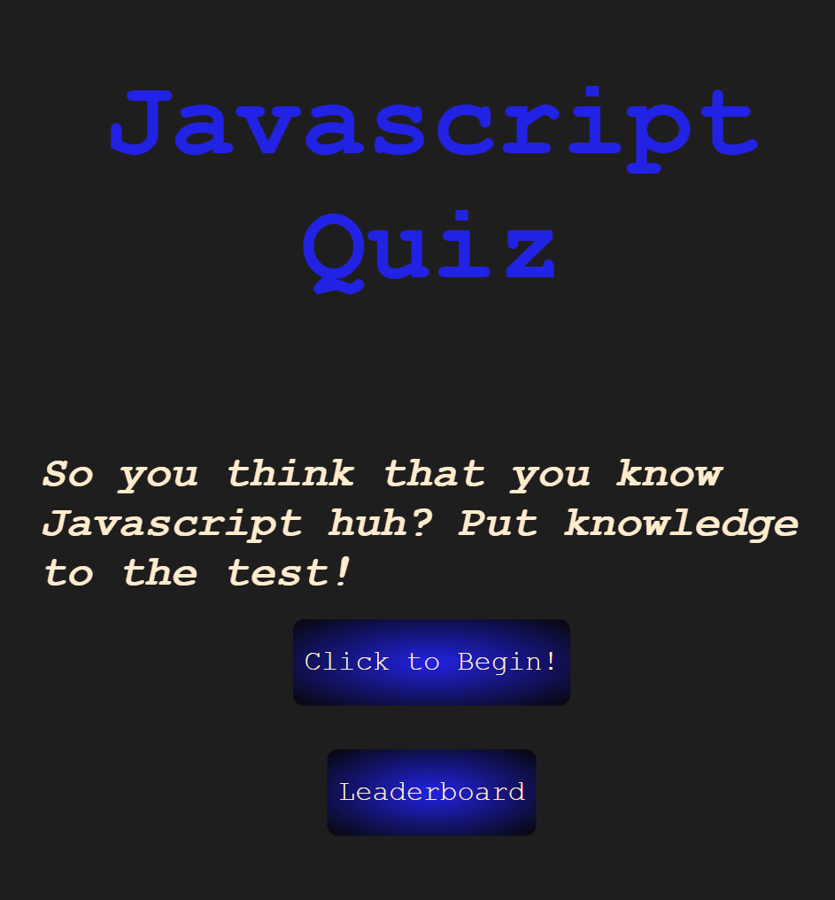
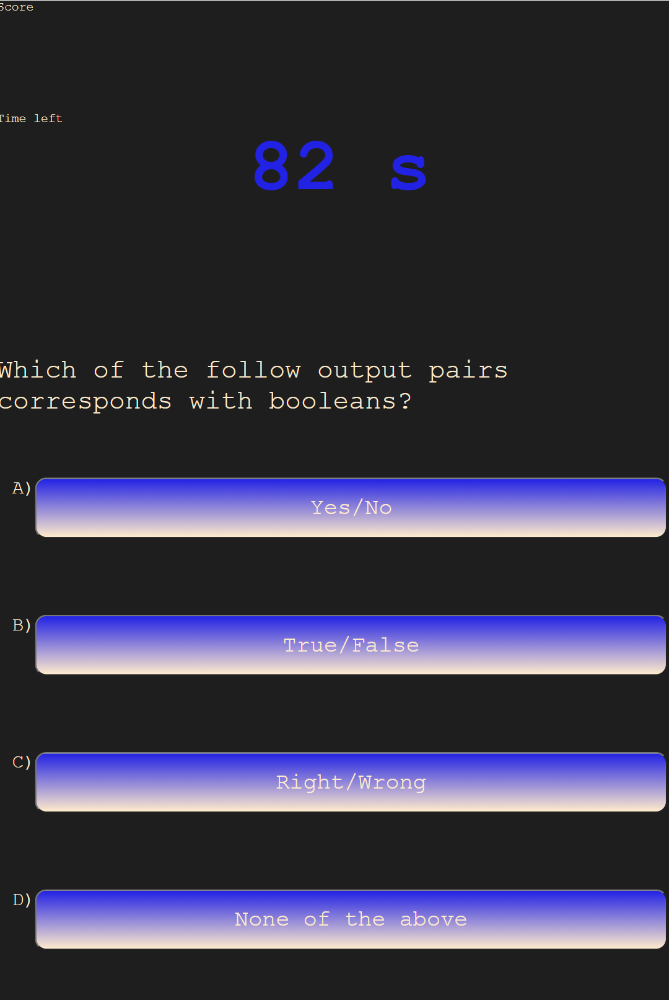

# JavaScript Quiz

## Description

This project allows a user to take a short multiple choice quiz on the basics of JavaScript. It also comes with a fully functioning leaderboard that allows you to complete with other players.

 [Deployed link](https://jaqwae.github.io/javascript-fundamentals-quiz/)

## Features

I've included the features below using:

- Fully functioning navigational buttons that allow the user to skip to a certain point.

- A timed quiz that not only add points for every correct answer, but subtracts time for every incorrect answer.

- A leaderboard that allows the user to input their initials and be displayed along side other users that have taken the test.

  

What's to come:

- Increasing the number of questions in the quiz.
- Randomizing the order of question each time the quiz is taken.
-A leaderboard that holds all of the players scores no matter what button is click.
-The answer choice will flash green if question is right, and red if question is wrong.
-A user interface that is more compact and mobile friendly.
- Potentially condensing the quiz into one html element.

  

## Images

;
;
<!-- update once leaderboard screen is fixed with css -->
  

## Credits

- JaQwae Ellison